# minitorch
The full minitorch student suite. 

To access the autograder: 

* Module 0: https://classroom.github.com/a/qDYKZff9
* Module 1: https://classroom.github.com/a/6TiImUiy
* Module 2: https://classroom.github.com/a/0ZHJeTA0
* Module 3: https://classroom.github.com/a/U5CMJec1
* Module 4: https://classroom.github.com/a/04QA6HZK
* Quizzes: https://classroom.github.com/a/bGcGc12k

## Task 0.5

### Simple

- weight_0_0 = -1
- weight_1_0 = 0
- bias_0 = 0.5

## Task 1.5

### Simple

- Число точек: 50
- Число нейронов в каждом скрытом слое: 2
- Learning rate: 0.5
- Число эпох: 500

Обучение завершено за 500 эпох. На последней эпохе loss = 8.146478,
число правильно классифицированных точек — 50.

[Полный лог обучения](logs/module1_simple.txt)

#### Результат классификации

#### График ошибки

### Xor

- Число точек: 50
- Число нейронов в каждом скрытом слое: 10
- Learning rate: 0.5
- Число эпох: 500

[Лог обучения](logs/module1_xor.txt)

Обучение завершено за 500 эпох. На последней эпохе loss = 17.368494,
правильно классифицировано 48 из 50 точек.

#### Результат классификации

#### График ошибки

### Diag

- Число точек: 50
- Число нейронов в каждом скрытом слое: 6
- Learning rate: 0.5
- Число эпох: 500

[Лог обучения](logs/module1_diag.txt)

Обучение завершено за 500 эпох. На последней эпохе loss = 6.465213,
правильно классифицировано 49 из 50 точек.

#### Результат классификации

#### График ошибки

### Split

- Число точек: 50
- Число нейронов в каждом скрытом слое: 10
- Learning rate: 0.5
- Число эпох: 500

[Лог обучения](logs/module1_split.txt)

Обучение завершено за 500 эпох. На последней эпохе loss = 13.536338,
правильно классифицировано 49 из 50 точек.

#### Результат классификации

#### График ошибки

## Task 2.5

### Simple

- Число точек: 50
- Число нейронов в каждом скрытом слое: 2
- Learning rate: 0.5
- Число эпох: 500
- Среднее время на эпоху: 0.045 с
- Время последней эпохи: 0.043 с

На последней эпохе loss = 11.738940,
правильно классифицировано 48 из 50 точек (96%).

[Полный лог обучения со временем эпох](logs/module2_simple.txt)

#### Результат классификации

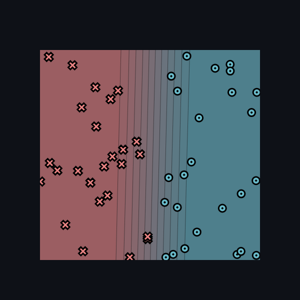

#### График ошибки

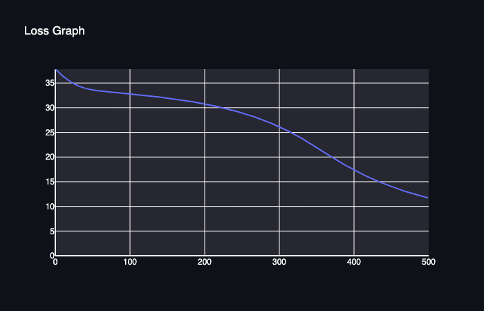

### Xor

- Число точек: 50
- Число нейронов в каждом скрытом слое: 10
- Learning rate: 0.5
- Число эпох: 800
- Среднее время на эпоху: 0.318 с
- Время последней эпохи: 0.312 с

На последней эпохе loss = 15.167903,
правильно классифицировано 47 из 50 точек (94%).

[Полный лог обучения со временем эпох](logs/module2_xor.txt)

#### Результат классификации

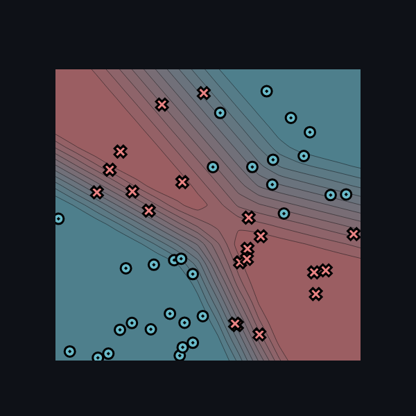

#### График ошибки

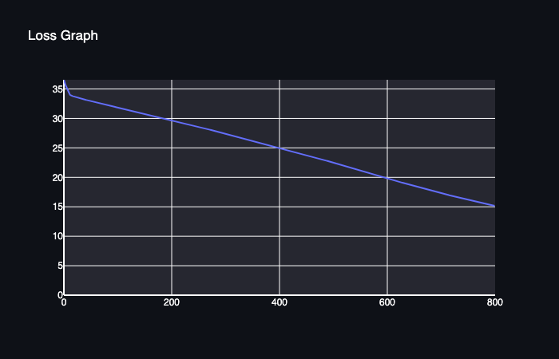

### Diag

- Число точек: 50
- Число нейронов в каждом скрытом слое: 6
- Learning rate: 0.5
- Число эпох: 500
- Среднее время на эпоху: 0.150 с
- Время последней эпохи: 0.158 с

На последней эпохе loss = 5.841125,
правильно классифицировано 48 из 50 точек (96%).

[Полный лог обучения со временем эпох](logs/module2_diag.txt)

#### Результат классификации

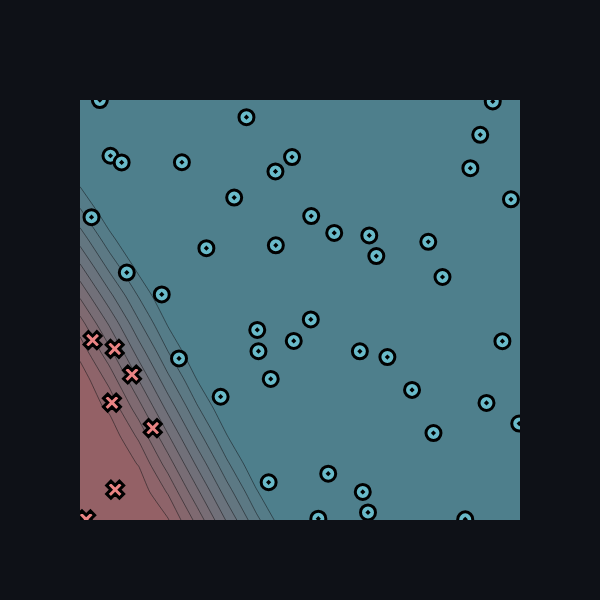

#### График ошибки

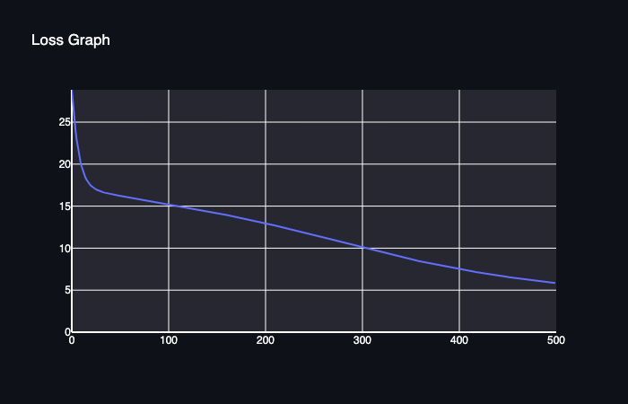

### Split

- Число точек: 50
- Число нейронов в каждом скрытом слое: 10
- Learning rate: 0.5
- Число эпох: 500
- Среднее время на эпоху: 0.322 с
- Время последней эпохи: 0.320 с

На последней эпохе loss = 21.032754,
правильно классифицировано 44 из 50 точек (88%).

[Полный лог обучения со временем эпох](logs/module2_split.txt)

#### Результат классификации

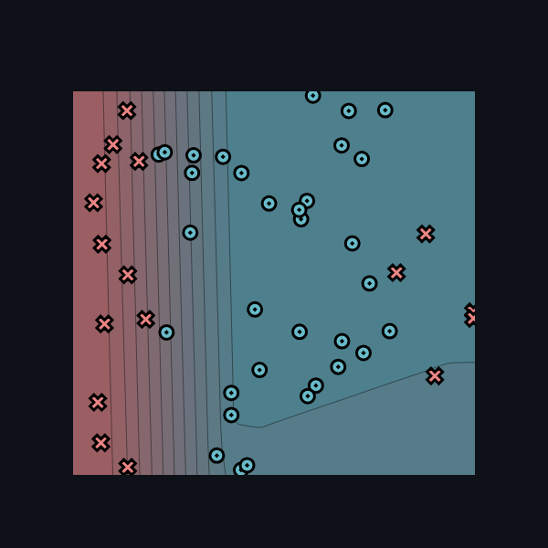

#### График ошибки

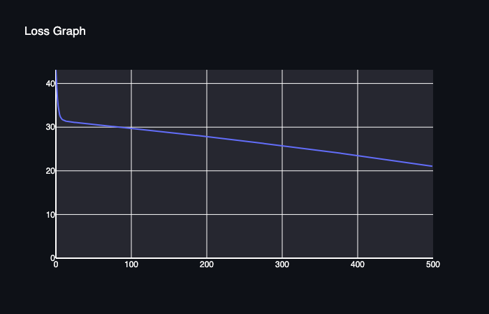

### Circle

- Число точек: 50
- Число нейронов в каждом скрытом слое: 15
- Learning rate: 0.5
- Число эпох: 500
- Среднее время на эпоху: 0.627 с
- Время последней эпохи: 0.613 с

На последней эпохе loss = 17.412071,
правильно классифицировано 45 из 50 точек (90%).

[Полный лог обучения со временем эпох](logs/module2_circle.txt)

#### Результат классификации

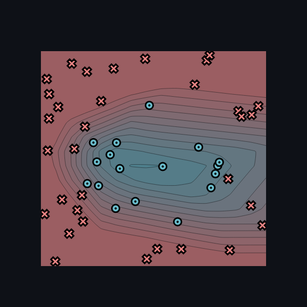

#### График ошибки

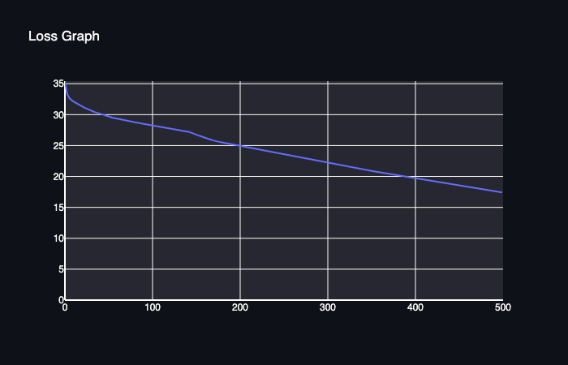

### Spiral

- Число точек: 50
- Число нейронов в каждом скрытом слое: 30 (по указанным настройкам)
- Learning rate: не указан в предоставленном логе
- Число эпох: 1060
- Среднее время на эпоху последнего запуска: 1.548 с
- Время последней сохранённой эпохи: 1.543 с

На эпохе 1060 последнего запуска
loss = 32.804920, правильно классифицировано 27 из 50 точек (54%).
Обучение вышло на плато.

[Лог обучения со временем эпох](logs/module2_spiral.txt)

#### Результат классификации

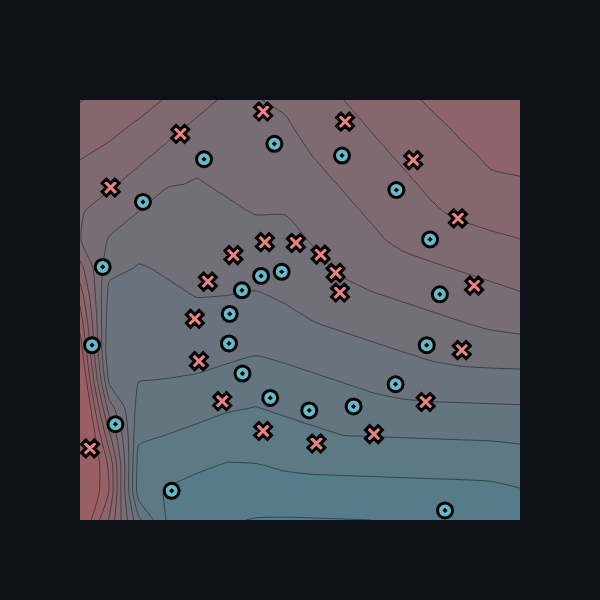

#### График ошибки

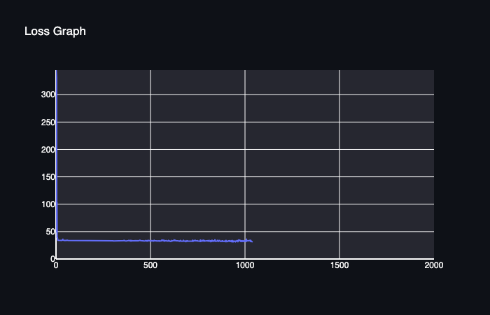
