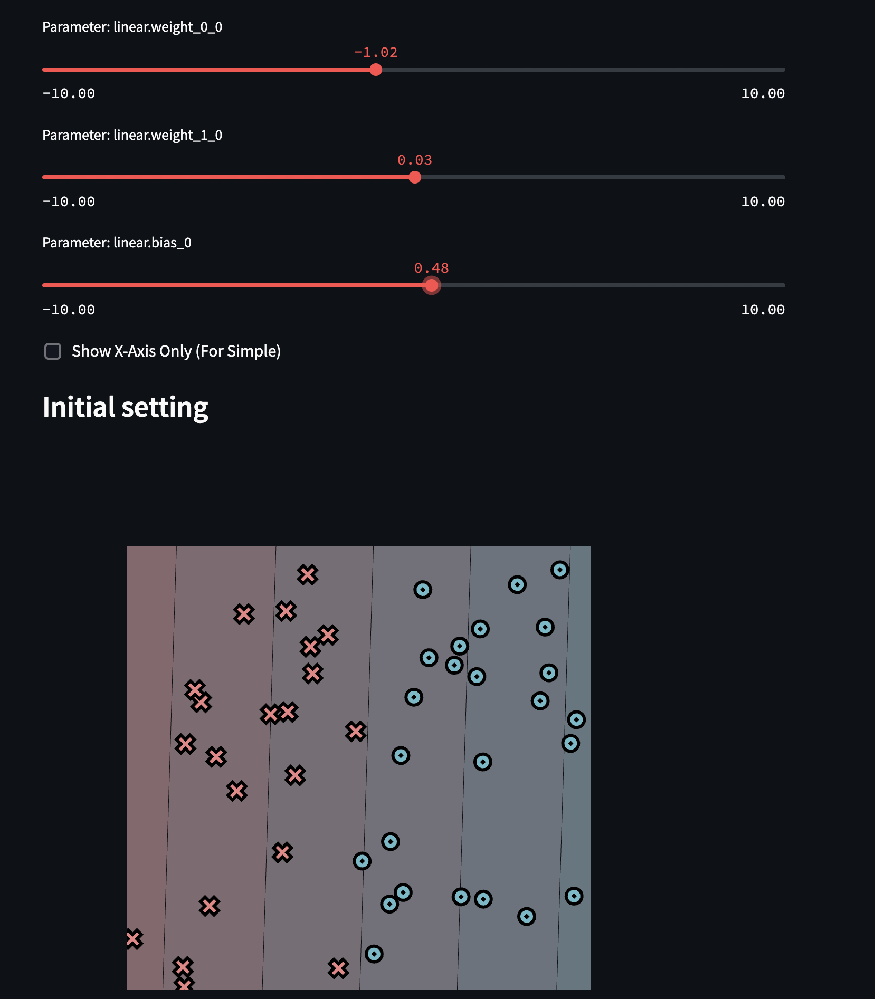
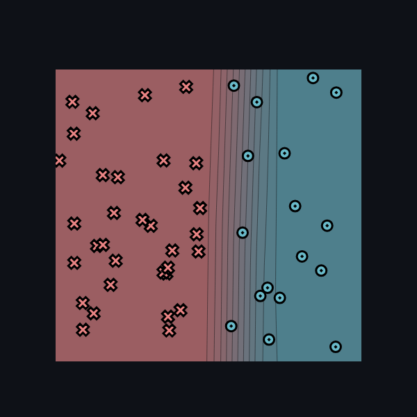
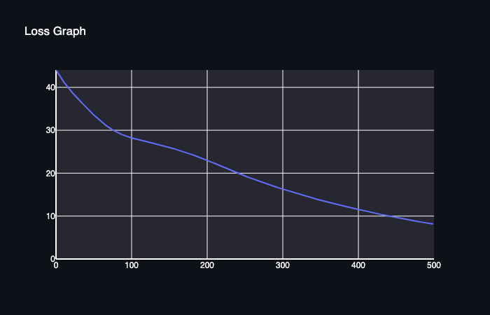
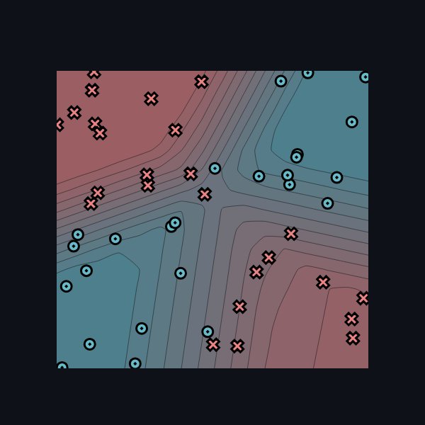
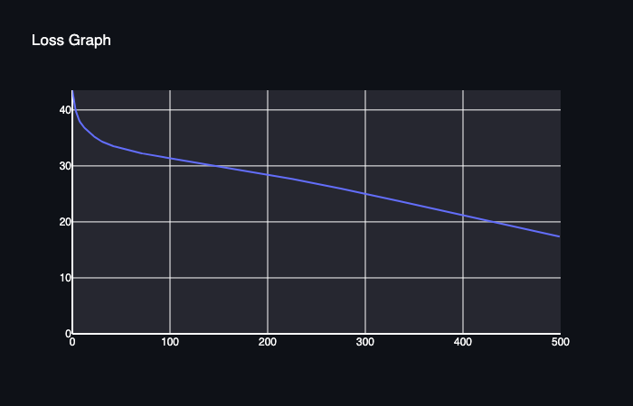
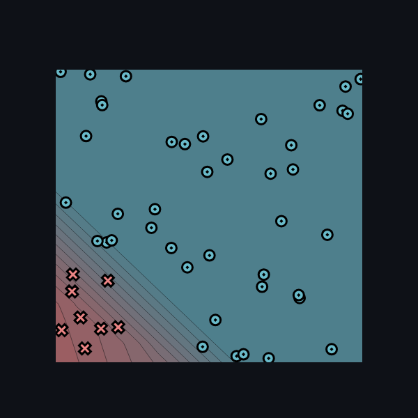
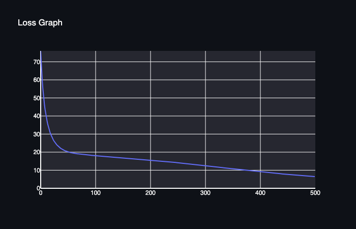
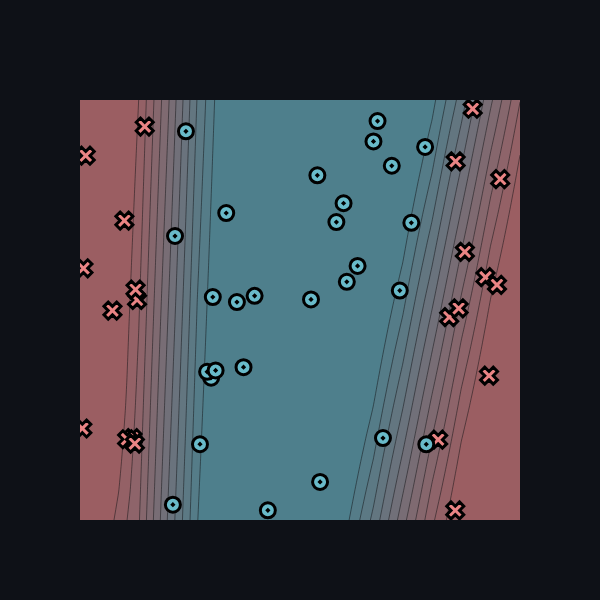
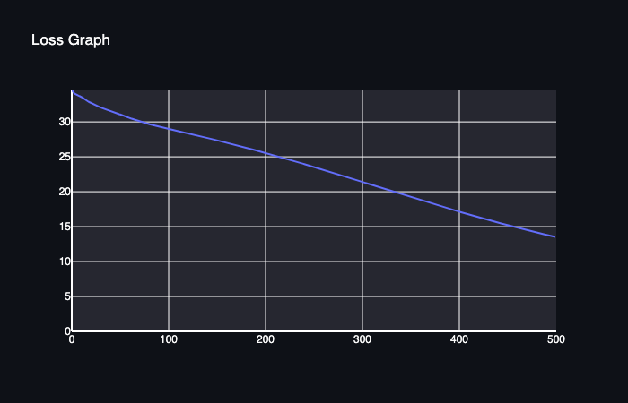

# minitorch
The full minitorch student suite. 

To access the autograder: 

* Module 0: https://classroom.github.com/a/qDYKZff9
* Module 1: https://classroom.github.com/a/6TiImUiy
* Module 2: https://classroom.github.com/a/0ZHJeTA0
* Module 3: https://classroom.github.com/a/U5CMJec1
* Module 4: https://classroom.github.com/a/04QA6HZK
* Quizzes: https://classroom.github.com/a/bGcGc12k

## Task 0.5

### Simple

- weight_0_0 = -1
- weight_1_0 = 0
- bias_0 = 0.5

## Task 1.5

### Simple

- Число точек: 50
- Число нейронов в каждом скрытом слое: 2
- Learning rate: 0.5
- Число эпох: 500

Обучение завершено за 500 эпох. На последней эпохе loss = 8.146478,
число правильно классифицированных точек — 50.

[Полный лог обучения](logs/module1_simple.txt)

#### Результат классификации

#### График ошибки

### Xor

- Число точек: 50
- Число нейронов в каждом скрытом слое: 10
- Learning rate: 0.5
- Число эпох: 500

[Лог обучения](logs/module1_xor.txt)

Обучение завершено за 500 эпох. На последней эпохе loss = 17.368494,
правильно классифицировано 48 из 50 точек.

#### Результат классификации

#### График ошибки

### Diag

- Число точек: 50
- Число нейронов в каждом скрытом слое: 6
- Learning rate: 0.5
- Число эпох: 500

[Лог обучения](logs/module1_diag.txt)

Обучение завершено за 500 эпох. На последней эпохе loss = 6.465213,
правильно классифицировано 49 из 50 точек.

#### Результат классификации

#### График ошибки

### Split

- Число точек: 50
- Число нейронов в каждом скрытом слое: 10
- Learning rate: 0.5
- Число эпох: 500

[Лог обучения](logs/module1_split.txt)

Обучение завершено за 500 эпох. На последней эпохе loss = 13.536338,
правильно классифицировано 49 из 50 точек.

#### Результат классификации

#### График ошибки

